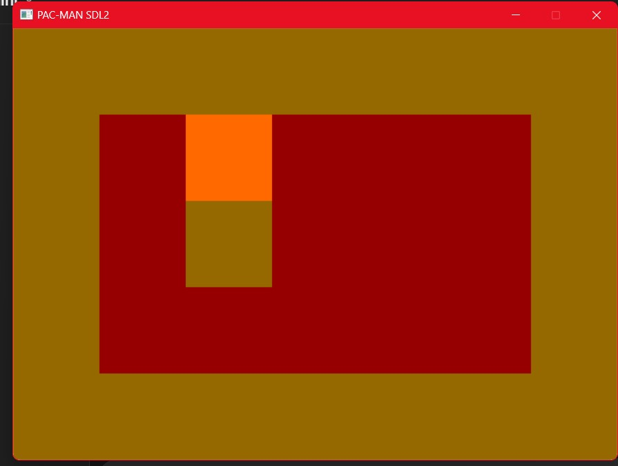

# Project 04 – [Pacman]
 
## 🕹️ Description
 
This is a turn-based grid game written in C++ using SDL2. Players take turns placing pieces using the keyboard and/or mouse.
 
## 🎮 Controls
 
- Use WASD keys to move yellow pacman to avoid black ghosts 
- Click x to exit game 
 
## 🧪 Screenshot
 

 
## ✨ Extra Features
 
- game lights up red if you lose, green if you've won
- To move player, use WASD 